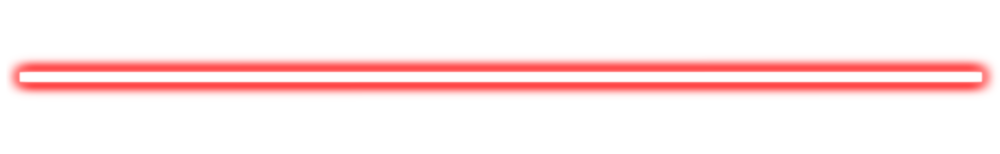

    

    🥰 I am currently studying at <b><a href="https://itmo.ru/" target="_blank">ITMO University</a> and <a href="https://education.tbank.ru/academy/backend/" target="_blank">T-Edu Backend Academy</a></b>
     

   🔥 Here you can check out my <b>CV: <a href="https://k6zma-cv.tiiny.site/" target="_blank">Click here</a></b>

 

        
        
        
        
        
        
         
         
        
        

    

    
    

        I'm a passionate and curious second-year student, currently mastering the art of Golang development. I thrive on learning new technologies and building impactful projects that can make a difference in the world. I believe in the power of coding to bring ideas to life and contribute to society. Let's create something amazing together!
    

    

    

    

    <h3>📚 <b>GoAlgoCraft</b></h3>
    

        A Go library offering efficient and flexible data structures and algorithms, including graphs, heaps, trees, lists, and queues. Perfect for simplifying common tasks in development.
    

    <ul>
        <li>Utilizes Go generics for flexibility and ease of use.</li>
        <li>Includes advanced structures like AVL trees, priority queues, and graph algorithms (DFS, BFS, Dijkstra).</li>
        <li>Supports custom comparison and equality functions.</li>
    </ul>
    
<b>Repository:</b> <a href="https://github.com/k6zma/GoAlgoCraft" target="_blank">GoAlgoCraft</a>

---

    <h3>🤖 <b>SurfShadow</b></h3>
    

        A Telegram bot designed to manage VPN configurations using VLESS and Shadowsocks protocols via the 3x-ui API. Provides a simple and intuitive way to handle VPN services.
    

    <ul>
        <li>Supports location selection for VPN servers;</li>
        <li>High bandwidth speeds from 1Gbps to 2Gbps;</li>
        <li>Low latency for a smooth and fast connection;</li>
        <li>24/7 user support for seamless service.</li>
    </ul>
    
<b>Repository:</b> <a href="https://github.com/SurfShadow" target="_blank">SurfShadow</a>

---

    <h3>🎓 <b>Labs Backend Academy (2024 - Present)</b></h3>
    

        A collection of practical mini-projects built during Backend Academy to strengthen backend development skills.
    

    <ul>
        <li><b>Hangman Game:</b> Console-based implementation of the classic "Hangman" game with difficulty levels and word categories;</li>
        <li><b>Maze Solver:</b> Generates and solves mazes with clear console visualization;</li>
        <li><b>LogAnalyzer:</b> NGINX log analyzer that extracts key metrics and outputs results in Markdown or ADOC formats;</li>
        <li><b>FractalFlameGenerator:</b> Single-threaded and multi-threaded fractal flame generator with customizable parameters.</li>
    </ul>
    
<b>Repository:</b> <a href="https://github.com/k6zma/T-Bank-Backend-Academy" target="_blank">Labs Backend Academy</a>

---

    <h3>🧪 <b>CavitationBubbles</b></h3>
    

        A machine learning and neural network-based project for determining alcohol concentration in water-ethanol solutions using ultrasound research.
    

    <ul>
        <li>Fast and accurate determination of alcohol concentration;</li>
        <li>Developed a user-friendly web service for seamless interaction with the models.</li>
    </ul>
    
<b>Repository:</b> <a href="https://github.com/k6zma/CavitationBubbles" target="_blank">CavitationBubbles</a>

    

    
    

---
